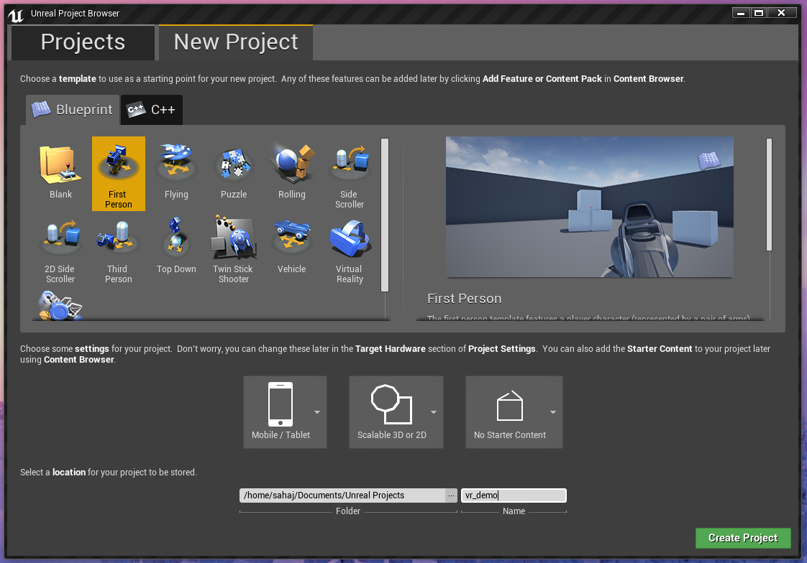
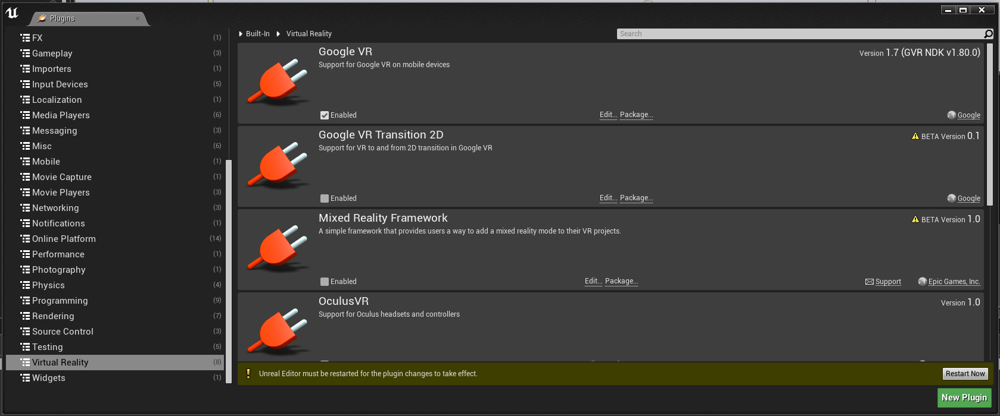
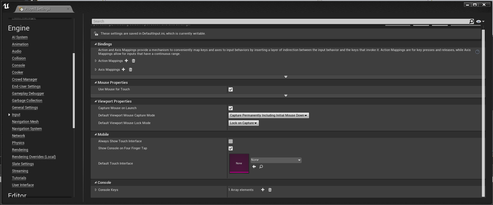
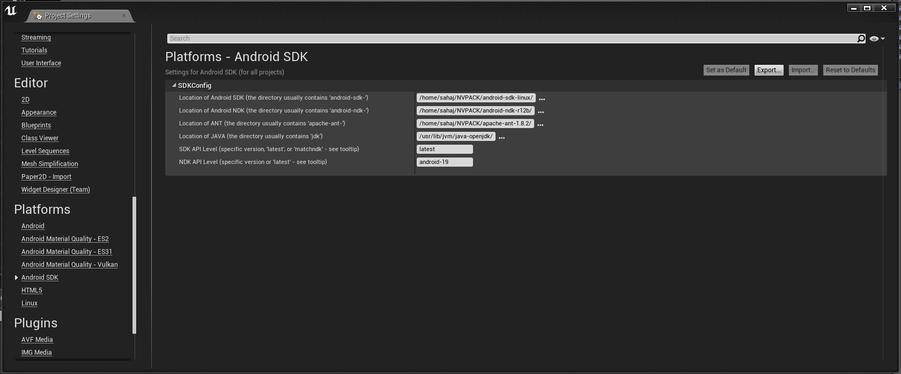
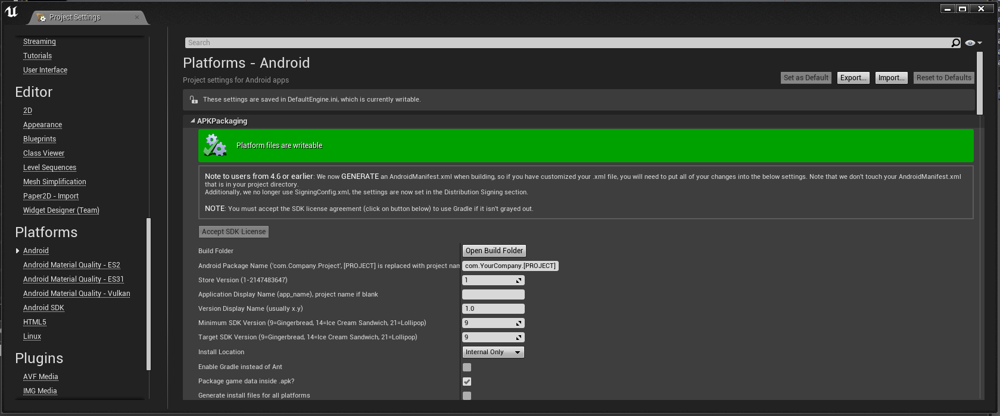
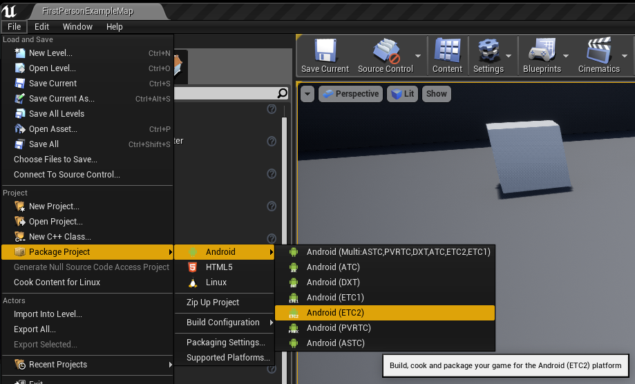

# VR App Development using 96Boards
###### v0.1

# Table of Contents
- [1) Hardware](#1-hardware)
   - [1.1) Hardware requirements](#11-hardware-requirements)
- [2) Software](#2-software)
   - [2.1) Operating System](#21-operating-system)
   - [2.2) Software Dependencies](#22-software-dependencies)
- [3) Developing a VR App](#3-developing-vr-app)
   - [3.1) Project setup](#31-project-setup)
   - [3.2) Deploy](#32-deploy)
- [4) Conclusion](#4-conclusion)

# 1) Hardware
## 1.1) Hardware requirements
- [96Boards CE](https://www.96boards.org/products/ce/)
  - [Hikey960  (Recomended)](https://www.96boards.org/product/hikey960/)
  - [Hikey](https://www.96boards.org/product/hikey960/)
- [96Boards Compliant Power Supply](http://www.96boards.org/product/power/)
- [Neonkey Mezzanine](https://www.96boards.org/product/neonkey/)
- [Linksprite 96Boards 7 Inch Display](https://www.arrow.com/en/products/96boards-display-7/linksprite-technologies-inc)


# 2) Software
## 2.1) Operating System
- [Custom AOSP build compiled for Neonkey compatibility](https://www.96boards.org/documentation/mezzanine/neonkey/guides/neonkey-aosp-build.md.html): The Neonkey Mezzanine provides us with all the required senors that are used for head tracking in the Google VR SDK. Since the AOSP Sensor HAL does not support dynamic detection or "hot plugging" of sensors, we need to compile AOSP from source to enable support for the neonkey mezzanine.

## 2.2) Software Dependencies

To develop our VR content, we will be using the [Unreal Engine 4 Editor](https://www.unrealengine.com/en-US/what-is-unreal-engine-4). Although Google VR SDK can be used with both Unity and Unreal Engine 4, I personally prefer UE4 for its MASSIVE cross platform compatibility and the **Unreal Engine 4 Editor** itself being available on **Linux** based OS allowing us to use Linux to develop VR games and Demos, unlike Unity which is restricted to Mac and Windows.

  - **Installing Unreal Engine 4 Editor**
    - [Linux](https://wiki.unrealengine.com/Building_On_Linux)
    - [Windows and Mac](https://docs.unrealengine.com/latest/INT/GettingStarted/Installation/index.html)
  - **[Installing NVIDIA CodeWorks:](https://docs.unrealengine.com/latest/INT/Platforms/Android/GettingStarted/1/)** Select your OS accordingly

    Although an NVIDIA GPU in not required at all, I developed this demo using a Intel HD P630 GPU, NVIDIA CodeWorks needs to be install as it provides the Android SDK and NDK support required by UE4 to build Android packages.

# 3) Developing a VR App    
## 3.1) Project Setup
  - **Start Unreal Engine Editor 4**
  - **From the Unreal Projects Browser create a new Blueprint based project with the following options.**
    - Use the First Person Template
    - Set target hardware to Mobile / Tablet
    - Set the Graphics level to Scalable 3D or 2D
    - Do not include the Starter Content
    - Give the project a name of vr_demo
    - 
  - **Setup Project for VR**
    - **Google VR Plugin**
      - Edit -> Plugins
      - From the "Virtual Reality" option Select "Google VR"
      - If the Editor requests to restart to enable the plugin, click "Restart Now".
      - 
    - **Modify Project Properties for VR**
      - **Edit -> Project Settings**
      - **Clear Default Touch Interface**
        - Select Input Settings under Engine
        - Make sure that the Default Touch Interface is set to clear by selecting "none" from the drop down menu
        - 
      - **Make sure HDR is turned off under Rendering**
      - **Setup Android SDK:** Under Platforms, Android SDK, make sure the SDK, NDK and JDK paths are correctly setup.
        - 
      - **Android Configuration Setup**: Under Projects, Android, make sure the following things are enabled
        - If you see a red banner saying "Project not configured... ", click "Configure Now"
        - Accept SDK License
        - Make sure "Enable Gradle instead on ANT" is NOT selected.
        - It is recommended to select "Package game data inside .apk" for ease of installation.
        - If you are building for the Hikey960 Feel free to select OpenGL ES3.1 under "Builds" Section.
        - It is recommended to select arm64/armv8 as well since both the HiKey boards support 64bit apps.
        - 

## 3.2) Deploy
  - **To deplay the VR application to the 96Boards development board:**
    - 1) File -> Package Product -> Android
    - 2) Select:
      - ETC 1: If you are using OpenGL ES 2 or the Hikey board
      - ETC 2: If you are using OpenGL ES 3.1 and the Hikey960
      - 
    - 3) Select the output folder
    - 4) ... This might take a while
    - 5) Navigate to the output folder and you should see a folder named ```Android_ETC2``` or ```Android_ETC1``` and inside said folder you would find the ```vr_demo-arm64-es2.apk```
    - 6) Connect the board to the host system and Install the apk using adb:

    ```shell
    $ cd <project output folder>
    $ adb install vr_demo-arm64-es2.apk
    ```

# 4) Conclusion
Although this project only covers the Unreal Engine 4, there is no such limitation. With the Mali G-71 GPU on boards the Hikey960 and quad cortex A73 BIG cores, It is a grate choice of hardware to develop and test VR Games and applications. On the other hand the neonkey provides excellent head tracking with its BMI160 based 9 axis accelerometer and gyroscope.
